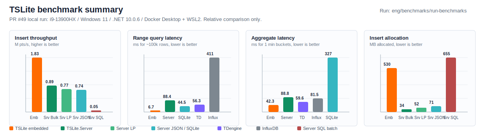

# SonnetDB

[中文](README.md) | [English](README.en.md)

[](https://github.com/maikebing/SonnetDB/actions/workflows/ci.yml)
[](https://github.com/maikebing/SonnetDB/actions/workflows/codeql.yml)
[](LICENSE)
[](https://dotnet.microsoft.com/)

SonnetDB 是一个使用 C# / .NET 10 构建的时序数据库项目，既可以作为嵌入式引擎在进程内运行，也可以通过 `SonnetDB` 以 HTTP 服务、管理后台和帮助中心的形式部署。

当前版本的持久化形态是“数据库目录 + schema/catalog/WAL/segments/tombstones”文件集合，而不是单个数据库文件。根目录下的帮助文档、CLI、ADO.NET 提供程序和服务端都围绕这一实际实现编写。

## 当前组成

| 组件 | 说明 |
| --- | --- |
| `src/SonnetDB` | 嵌入式时序引擎，负责 schema、写入、查询、删除、WAL、MemTable、Segment、Compaction、Retention |
| `src/SonnetDB.Data` | ADO.NET 提供程序，统一支持本地嵌入式和远程 `SonnetDB` |
| `src/SonnetDB.Cli` | 命令行工具 `sndb`：本地/远程连接、profile 管理（`local`/`remote`/`connect`）、交互式 REPL |
| `src/SonnetDB` | HTTP 服务、首次安装流程、用户与授权、SSE、Admin UI、内置 `/help` 文档站点 |
| `web` | 管理后台前端（SPA 调试 + 发布静态资源） |
| `docs` | JekyllNet 文档站点源码；构建镜像时会生成并打包到 `/help` |

## 当前能力

- 嵌入式运行：通过 `Tsdb.Open(...)` 在进程内直接打开数据库目录。
- Schema 管理：支持 `CREATE MEASUREMENT`，measurement 具有显式 tag/field schema。
- 数据写入：支持 SQL `INSERT`、直接 `Point`/`WriteMany`、ADO.NET `CommandType.TableDirect` 批量快路径。
- 数据查询：支持原始点查询、范围过滤、聚合函数、`GROUP BY time(...)` 时间桶聚合。
- 数据删除：支持 `DELETE FROM ... WHERE ...`，底层通过 tombstone 与 compaction 生效。
- 远程访问：`SonnetDB.Data` 可通过 `sonnetdb+http://...` 连接 `SonnetDB`。
- 管理控制面：支持用户、数据库、授权、Token 的 SQL 管理语句。
- 运维入口：提供 `/admin/`、`/help/`、`/healthz`、`/metrics`、`/v1/events`。

## 快速开始

### 1. 嵌入式最小示例

```csharp
using SonnetDB.Engine;
using SonnetDB.Sql.Execution;

using var db = Tsdb.Open(new TsdbOptions
{
    RootDirectory = "./demo-data",
});

SqlExecutor.Execute(db, """
CREATE MEASUREMENT cpu (
    host TAG,
    usage FIELD FLOAT
)
""");

SqlExecutor.Execute(db, """
INSERT INTO cpu (time, host, usage)
VALUES (1713676800000, 'server-01', 0.71)
""");

var result = (SelectExecutionResult)SqlExecutor.Execute(
    db,
    "SELECT time, host, usage FROM cpu WHERE host = 'server-01'")!;

foreach (var row in result.Rows)
{
    Console.WriteLine($"{row[0]} {row[1]} {row[2]}");
}
```

### 2. 启动服务端

```bash
docker build -f src/SonnetDB/Dockerfile -t sonnetdb .
docker run --rm -p 5080:5080 -v ./sonnetdb-data:/data sonnetdb
```

仓库的 Docker 发布工作流会额外构建并推送预编译镜像 `iotsharp/sonnetdb` 与 `ghcr.io/<owner>/sonnetdb`。当仓库 Secrets 配置完成后，也可以直接拉取：

```bash
docker run --rm -p 5080:5080 -v ./sonnetdb-data:/data iotsharp/sonnetdb:latest
```

启动后访问：

- `http://127.0.0.1:5080/admin/`
- `http://127.0.0.1:5080/help/`

当 `/data/.system` 为空时，`/admin/` 会进入首次安装流程，要求设置：

- 服务器 ID
- 组织名称
- 管理员用户名
- 管理员密码
- 初始静态 Bearer Token

### 3. 通过 ADO.NET 访问

```csharp
using SonnetDB.Data;

using var connection = new SndbConnection("Data Source=./demo-data");
connection.Open();

using var command = connection.CreateCommand();
command.CommandText = "SELECT count(*) FROM cpu";

var count = (long)(command.ExecuteScalar() ?? 0L);
Console.WriteLine(count);
```

远程连接示例：

```csharp
using SonnetDB.Data;

using var connection = new SndbConnection(
    "Data Source=sonnetdb+http://127.0.0.1:5080/metrics;Token=your-token");
connection.Open();
```

### 4. 通过 CLI 访问

```bash
# 安装
dotnet tool install --global SonnetDB.Cli --version 0.1.0

# 本地直接使用
sndb local --path ./demo-data --command "SELECT count(*) FROM cpu"

# 保存 profile，下次免输路径
sndb local --path ./demo-data --save-profile home --default
sndb connect home --command "SELECT count(*) FROM cpu"

# 连接远程服务端
sndb remote --url http://127.0.0.1:5080 --database metrics --token your-token --repl
```

更完整的 CLI、ADO.NET、嵌入式、远程和批量写入示例见 [docs](docs/index.md)。

## 数据模型

SonnetDB 采用典型的时序数据建模方式：

| 概念 | 说明 |
| --- | --- |
| `measurement` | 一类时序对象或指标集合，例如 `cpu`、`memory`、`meter_reading` |
| `tag` | 参与序列身份识别和过滤的维度，例如 `host`、`region`、`device_id` |
| `field` | 真实观测值，例如 `usage`、`temperature`、`status` |
| `time` | 保留时间列，作为写入、查询、删除的时间轴，不需要在 schema 中单独声明 |
| `series` | `measurement + sorted(tags)` 规范化后形成的逻辑时间序列 |

支持的 field 类型：

- `FLOAT`
- `INT`
- `BOOL`
- `STRING`

建模建议：

- 把筛选维度放在 tag。
- 把随时间变化的采样值放在 field。
- 保持同一个 measurement 的 schema 稳定。
- 使用 `time` 作为唯一的时间列，而不是额外再定义一个“时间字段”。

## SQL 与访问方式

当前真实支持的数据面 SQL：

- `CREATE MEASUREMENT`
- `INSERT INTO ... VALUES (...)`
- `SELECT ... FROM ... [WHERE ...] [GROUP BY time(...)]`
- `DELETE FROM ... WHERE ...`

### 支持的 SQL 函数

随 PR #50 ~ #56 落地，SonnetDB 在 `SELECT` 中支持以下内置函数；可通过 [`Tsdb.Functions`](docs/extending-functions.md) 注册自定义聚合 / 标量 / TVF（嵌入式模式）。Server 模式默认禁用 UDF。

| 函数 | 类别 | 引入 | 对标 | 备注 |
| --- | --- | --- | --- | --- |
| `count`, `sum`, `min`, `max`, `avg`, `first`, `last` | 聚合 (Tier 1) | PR #50 | InfluxDB / Timescale / TDengine 全量 | 基础聚合，支持 `GROUP BY time(...)` |
| `stddev`, `variance`, `spread`, `mode`, `median` | 聚合 (Tier 2) | PR #52 | InfluxDB `stddev` / TDengine `STDDEV` | 总体方差 / 标准差 |
| `percentile(x, p)`, `p50`, `p90`, `p95`, `p99`, `tdigest_agg` | 聚合 (T-Digest) | PR #52 | InfluxDB `quantile(method:"estimate_tdigest")`, TDengine `APERCENTILE` | 分位估计，常数空间复杂度 |
| `distinct_count` | 聚合 (HyperLogLog) | PR #52 | InfluxDB `distinct() \|> count()`, TDengine `HYPERLOGLOG` | 基数估计 |
| `histogram(x, n)` | 聚合 | PR #52 | Prometheus `histogram_quantile` 数据源 | 等宽分桶 |
| `pid(target, kp, ki, kd)`, `pid_estimate` | 聚合 (Control) | PR #54 | — | 增量式 PID 控制律输出 |
| `abs`, `round`, `sqrt`, `log`, `coalesce`, `time_bucket`, `date_trunc`, `extract`, `cast` | 标量 (Tier 1) | PR #51 | TDengine 标量函数 / Postgres `date_trunc` | 行级表达式 |
| `difference`, `delta`, `increase` | 窗口 | PR #53 | InfluxDB `difference` / TDengine `DIFF` | 相邻差分 |
| `derivative`, `non_negative_derivative`, `rate`, `irate` | 窗口 | PR #53 | InfluxDB `derivative` / Prometheus `rate` / TDengine `DERIVATIVE` | 时间归一化变化率 |
| `cumulative_sum`, `integral` | 窗口 | PR #53 | InfluxDB `cumulativeSum` / Timescale `time_weight` | 累积 / 时间加权积分 |
| `moving_average`, `ewma`, `holt_winters` | 窗口 (平滑) | PR #53 | InfluxDB `movingAverage` / `holtWinters`, TDengine `MAVG` | EMA / Holt 双指数平滑 |
| `fill`, `locf`, `interpolate` | 窗口 (插值) | PR #53 | InfluxDB `fill()`, TDengine `INTERP` | 缺失填充 |
| `state_changes`, `state_duration` | 窗口 (状态) | PR #53 | TDengine `STATECOUNT` / `STATEDURATION` | 状态机变换计数 |
| `pid_series` | 窗口 (Control) | PR #54 | — | 流式 PID 时序 |
| `anomaly(x, 'zscore'\|'iqr', k)`, `changepoint(x, 'cusum', k, drift)` | 窗口 (异常 / 变点) | PR #55 | TDengine `STATEDURATION` 配套 | 标记型 0/1 / 累积变点统计 |
| `forecast(measurement, field, n, 'linear'\|'holt_winters', [season])` | TVF | PR #55 | TDengine `FORECAST`(3.3.6+), Influx `holtWinters` | 表值函数：未来 N 步外推 |
| 用户自定义 | UDF | PR #56 | — | 嵌入式模式可注册聚合 / 标量 / TVF；详见 `docs/extending-functions.md` |

> 函数族基准：见 `tests/SonnetDB.Benchmarks/Benchmarks/FunctionBenchmark.cs`，对比 InfluxDB Flux 与 TDengine REST 的等价语义。

当前真实支持的服务端控制面 SQL：

- `CREATE USER`
- `ALTER USER ... WITH PASSWORD`
- `DROP USER`
- `CREATE DATABASE`
- `DROP DATABASE`
- `GRANT READ|WRITE|ADMIN ON DATABASE ... TO ...`
- `REVOKE ON DATABASE ... FROM ...`
- `SHOW USERS`
- `SHOW GRANTS [FOR user]`
- `SHOW DATABASES`
- `SHOW TOKENS [FOR user]`
- `ISSUE TOKEN FOR user`
- `REVOKE TOKEN 'tok_xxx'`

支持的访问路径：

- 进程内引擎：`SonnetDB.Engine.Tsdb`
- 嵌入式 SQL：`SonnetDB.Sql.Execution.SqlExecutor`
- ADO.NET：`SonnetDB.Data`
- CLI：`SonnetDB.Cli`
- 远程 HTTP：`SonnetDB`
- 批量快路径：`CommandType.TableDirect` 或 `/v1/db/{db}/measurements/{m}/{lp|json|bulk}`

## 架构总览

```text
Application / CLI / ADO.NET / Admin UI
                |
                v
      SQL / Remote HTTP / TableDirect
                |
                v
     Query Engine / Control Plane / Auth
                |
                v
  WAL -> MemTable -> Flush -> Segment -> Compaction
                |
                v
   catalog.SDBCAT / measurements.tslschema
   wal/*.SDBWAL / segments/*.SDBSEG
   tombstones.tslmanifest
```

数据库目录的实际布局：

```text
<database-root>/
├─ catalog.SDBCAT
├─ measurements.tslschema
├─ tombstones.tslmanifest
├─ wal/
│  └─ {startLsn:X16}.SDBWAL
└─ segments/
   └─ {id:X16}.SDBSEG
```

服务端控制面目录：

```text
<data-root>/.system/
├─ installation.json
├─ users.json
└─ grants.json
```

## 性能基准

> 以下摘要图来自 **PR #49** 同机粗略对比（i9-13900HX / Windows 11 / .NET 10.0.6 / Docker Desktop + WSL2，全集 24 个基准约 20 分钟）。InfluxDB 2.7、TDengine 3.3.4.3、`sonnetdb` 均跑在本机 Docker 容器中，仅作同机粗略对比，不代表生产部署性能。完整数据见 [tests/SonnetDB.Benchmarks/README.md](tests/SonnetDB.Benchmarks/README.md)。



一键运行本机基准：

```bash
dotnet run --project eng/benchmarks/run-benchmarks/run-benchmarks.csproj -- --filter *
```

基准入口由两个跨平台 C# 小工具组成：`start-benchmark-env.csproj` 负责构建并启动 [docker-compose.yml](tests/SonnetDB.Benchmarks/docker/docker-compose.yml) 中的 `sonnetdb`、InfluxDB、TDengine，并等待健康检查通过；`run-benchmarks.csproj` 负责调用环境入口并以 Release 模式运行 BenchmarkDotNet。README 只引用 [benchmark-summary.svg](docs/assets/benchmark-summary.svg)，后续刷新数字时优先更新 SVG 与 [基准 README](tests/SonnetDB.Benchmarks/README.md)，不需要反复改根 README 的表格。

向量召回基准见 [tests/SonnetDB.Benchmarks/Benchmarks/VectorRecallBenchmark.cs](tests/SonnetDB.Benchmarks/Benchmarks/VectorRecallBenchmark.cs) 与 [tests/SonnetDB.Benchmarks/README.md](tests/SonnetDB.Benchmarks/README.md)：当前已回填 SonnetDB 自身 `10k / 100k` 两档的 brute-force vs HNSW 实测耗时；`1M` 档位与 `sqlite-vec` / `pgvector` 同机粗略对比仍待后续长测补齐。

## 设计原则

- Safe-only：核心库在当前阶段不使用 `unsafe`，底层内存操作基于 `Span<T>`、`MemoryMarshal`、`BinaryPrimitives` 等安全 API。
- Schema-first：measurement 先定义 schema，再写入数据，减少类型漂移和歧义。
- Embedded-first：引擎优先服务进程内场景，再通过 ADO.NET、CLI 和 HTTP 暴露统一能力。
- Directory-based persistence：数据库以目录为单位持久化，不再追求单文件存储。
- Single API surface：本地和远程尽量复用同一套 SQL、ADO.NET 和 CLI 使用方式。
- Docs-in-image：`docs/` 在 Docker 构建时会通过 JekyllNet 构建进镜像并挂到 `/help`。

## 仓库结构

```text
SonnetDB/
├─ src/
│  ├─ SonnetDB/
│  ├─ SonnetDB.Data/
│  ├─ SonnetDB.Cli/
│  └─ SonnetDB/
├─ tests/
├─ web/
├─ docs/
├─ CHANGELOG.md
├─ ROADMAP.md
└─ AGENTS.md
```

## 文档导航

根 README 只保留项目概览和最短入门路径，详细示例统一放到 `docs/`：

- [开始使用](docs/getting-started.md)
- [数据模型](docs/data-model.md)
- [SQL 参考](docs/sql-reference.md)
- [嵌入式与 in-proc API](docs/embedded-api.md)
- [ADO.NET 参考](docs/ado-net.md)
- [CLI 参考](docs/cli-reference.md)
- [批量写入](docs/bulk-ingest.md)
- [架构总览](docs/architecture.md)
- [文件格式与目录布局](docs/file-format.md)
- [发布与打包](docs/releases/README.md)

## 相关文件

- 路线图见 [ROADMAP.md](ROADMAP.md)
- 变更记录见 [CHANGELOG.md](CHANGELOG.md)
- AI 协作规范见 [AGENTS.md](AGENTS.md)

## License

[MIT](LICENSE)
